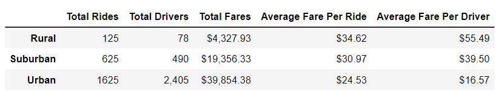

# PyBer_Analysis

## Overview of the analysis: Explain the purpose of the new analysis.

This project consisit on two main deliverables. The first one has the purpose of creating a DataFrame that displays ride sharing by city type. Deliverable 2 consisits in creating a multiple- line graph that shows the total weekly fares for each city type for 2019 from January to April. Both deliverables aim to show how data differs by city type and how those differences can be used by decision makers at Pyber.

## Results: Using images from the summary DataFrame and multiple-line chart, describe the differences in ride-sharing data among the different city types.

From deliverable 1 we can conclude that the highest number of total drivers and total rides are in cities located in an urban zone. Whereas the cities located in rural zones have the least number of total drivers and rides. The total fares per city type are highest in urban zones and smallest in rural zones. However the average fare per ride and driver is higher in rural zones than in urban and suburban zones. The next image shows the complete DataFrame where we can compare the metrics mentioned before: 

From deliverable 2 we confirmed the results obtained from the the previous table, in relation to the fares per city type. We can see that the urban zone type has the highest fares, followed by suburban and then rural zone type. For January we can see that urban and suburban cities have a similar behaviour. 

Then from the first week of February up to the first week of April suburban and rural behave very similar to one another. Both having higher fares the fourth week of February. The highest fares for urban cities  are on the last week on frebruary and the second week of march. For suburban the highest fares are on the last week of february and last week of april. And for rural cities the highest fares are on the first week of April.

## Summary: Based on the results, provide three business recommendations to the CEO for addressing any disparities among the city types.
Based on the results my recomendation for the PyBer CEO are the following:

* The average fares per driver and ride are very high for rural cities. This outcome may be due to the few drivers available in this zone compared to other zones. So a possible solution to this problem would be to increase the number of drivers for rural cities, because in this way the average fare per ride and average fare per driver may decrease and balance a little bit more with the suburban and urban cities. 

*  The total average fares for rural cities are very low, even though the average fares per city and driver are really high. So that would be something to look up in more detail.

*  It is evident that there are some weeks that the total fares are very low so a possible strategy to increase these numbers could be to lower the fare per ride so that more people is tempted to use the service. 
